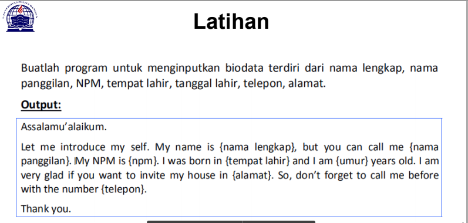

# pertemuan6_smt1
Repository ini dibuat untuk memenuhi tugas Bahasa pemrograman pertemuan ke 6    
Nama : Mulifatkhul Rachiim

NIM : 312010180

Kelas : TI.20.B.1  

DAFTAR ISI  
| No | Description | Link |
| ----- | ----- | ----- |
| 1 | Tugas pertemuan 5 | [Tugas_pertemuan_5] (#pertemuan6_smt1#pertemuan-5---tugas)
| 2 | Tugas pertemuan 6 Lab 1 | [Tugas_part6_Lab2](#pertemuan-6---lab-2)
| 3 | Tugas pertemuan 6 Lab 2 | [Tugas_part6_Lab1](#pertemuan-6---lab-1)
 

## pertemuan 5 - Tugas

pada pertemuan 5 bahasa pemrograman saya diberi tugas oleh Dosen membuat Aplikasi Biodata python (seperti Gambar di bawah ini)
 
Saat ini saya akan menjelaskan hasil dari tugas tersebut. 
berikut "